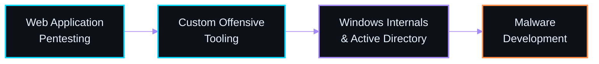

<div align="center">



<a href="https://linkedin.com/in/turqay-memmedli-58296a357"></a>
<a href="mailto:turqaymemmedli01@gmail.com"></a>


</div>

---

### `▸ 01` &nbsp; OPERATOR PROFILE

```bash
$ whoami
turgay_memmedli — junior penetration tester

$ cat ~/.operator_profile
ROLE        : Junior Penetration Tester
EDUCATION   : Information Security student, Azerbaijan (grad. 2027)
TRAINING    : 435+ hours of hands-on offensive security
DOMAINS     : ( web_application · active_directory · network · red_team_infra )
OBJECTIVE   : Windows internals & AD exploitation  ->  Malware Development
PRINCIPLE   : "Build it from scratch, or you never really learned it."
```

---

### `▸ 02` &nbsp; ARSENAL

| Domain | Tooling & Techniques |
| :--- | :--- |
| **Recon & OSINT** | `Google Dorks` · `Wayback Machine` · `SET` · `SocialPhish` · `exiftool` · subdomain & asset discovery |
| **Network & Traffic** | `Nmap` · `Wireshark` · `Bettercap` · `Responder` · `Aircrack-ng` · `NetDiscover` · ARP Spoofing, MAC Flooding, DHCP Starvation |
| **Web Application** | `Burp Suite` · `OWASP ZAP` · `sqlmap` · `WPScan` · `JoomScan` · OWASP Top 10 — SQLi, XSS, XXE, SSRF, CSRF, JWT, File Upload, Path Traversal |
| **Exploitation & Post-Ex** | `Metasploit` · `msfvenom` · `Mimikatz` · Windows & Linux Privilege Escalation |
| **Active Directory** | `BloodHound` · `PowerView` · `Kerbrute` · Kerberoasting, AS-REP Roasting, Golden / Silver Tickets, Lateral Movement |
| **Pivoting & Tunneling** | `Chisel` · `Ligolo-ng` · internal subnet traversal |
| **Credentials & Crypto** | `Hashcat` · `Crunch` · `CrackStation` · `steghide` · hash cracking & steganography |
| **Red Team Infrastructure** | `Cobalt Strike` · `Havoc` — deployed and operated in isolated lab environments |
| **Scripting & Dev** | `Python` · `Bash` · `SQL` · `HTML/CSS` · reading `JavaScript` for client-side vulnerability analysis |

<div align="center">


</div>

---

### `▸ 03` &nbsp; CREDENTIALS

<div align="center">


<br>


<sub>eCPPT `169301320` · eJPT `161571351` · Web-RTA `69d3a97540705472a1755a16` · CWSE `HV-CWSE-VBVKIXV9` · CAPT `HV-CAPT-JV76NZE3`</sub>

</div>

---

### `▸ 04` &nbsp; DISCLOSURE & RECOGNITION

> **OpenStreetMap** — reported a path traversal vulnerability allowing unauthorized file reads on `openstreetmap.org`.
> Fix shipped by the OSM website maintainers, with public credit in their official changelog.
>
> [`community.openstreetmap.org →`](https://community.openstreetmap.org/t/what-s-new-on-the-openstreetmap-website/130080/47)

<div align="center">

[](https://community.openstreetmap.org/t/what-s-new-on-the-openstreetmap-website/130080/47)

</div>

---

### `▸ 05` &nbsp; CTF & COMPETITIONS

<div align="center">


<sub>NovruzCTF credential `CCERT-E3EE-38DF` · Labs: TryHackMe · Hack The Box · PortSwigger Web Security Academy · VulnHub</sub>

</div>

---

### `▸ 06` &nbsp; TRAJECTORY



---

### `▸ 07` &nbsp; PROJECT

<div align="center">

[](https://github.com/erbiseynqzi/WebPen3)

<sub>Multi-threaded Bash tool for automated IP discovery, subdomain enumeration and directory brute-forcing, with structured results logging</sub>

</div>

---

### `▸ 08` &nbsp; ACTIVITY

<div align="center">


</div>

---

<div align="center">

<sub>`$ exit` &nbsp;— &nbsp;thanks for stopping by. Always testing, always learning.</sub>


</div>
